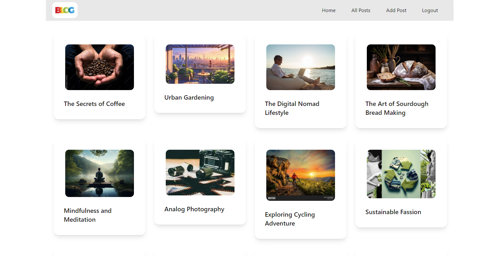

# **REACT JS BASED BLOG WEB APP**

## Table of Contents

- [Features](#features)
- [Tech Stack](#tech-stack)
- [Deployment](#deployment)
- [Authors](#authors)
- [Acknowledgements](#acknowledgements)
- [Support](#support)

## Features

- **User Authentication**: 
  - Login and Register functionality.

- **Blog Management**:
  - Create, update, and delete blog posts.
  - Upload and manage featured images for posts.
  - Rich Text Editor (RTE) for creating and editing post content.

- **Post Display**:
  - View all posts on the homepage.
  - Detailed view of individual posts.

## Tech Stack

**Front-end:**

- React
- Redux
- Daisy UI

**Back-end:**

- Appwrite (Backend as Service)

## Deployment

Hosting platform: [Varcel](url)

## Authors

- [@Sameer Shrikhande](https://github.com/sameershrikhande)

## Acknowledgements

- [React](https://react.dev/)
- [Daisy UI](https://daisyui.com/)
- [Appwrite](https://appwrite.io/)

## Support

For support, contact:

- Email: sameershrikhande6@gmail.com
- LinkedIn: [Sameer Shrikhande](https://www.linkedin.com/in/sameershrikhande/)